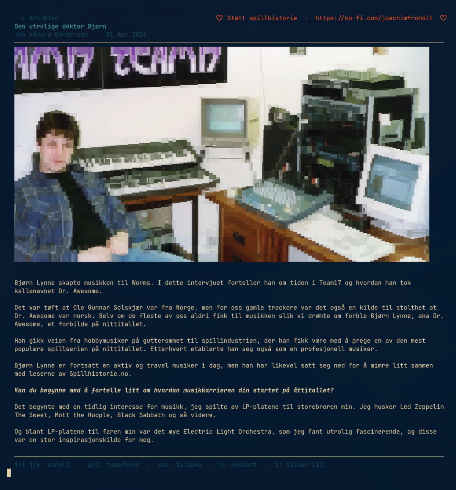

# spillhistorie

A terminal client for [spillhistorie.no](https://spillhistorie.no) — *Litt retro - litt nytt*.

Browse articles and listen to podcasts about gaming history directly in your terminal.



## Install

```sh
curl -fsSL https://raw.githubusercontent.com/jhgundersen/spillhistorie-tui/main/install.sh | sh
```

Downloads the latest release for your OS and architecture to `/usr/local/bin` (or `~/.local/bin` if you don't have write access there).

> **Note:** If `~/.local/bin` is used, make sure it is in your `$PATH`.

## Optional: mpv and chafa

The app works without these, but they unlock extra features:

| Tool | What it enables | Install |
|------|----------------|---------|
| [mpv](https://mpv.io) | Podcast playback | See below |
| [chafa](https://hpjansson.org/chafa/) | Images rendered in the terminal | See below |

### mpv

| Platform | Command |
|----------|---------|
| Arch Linux | `sudo pacman -S mpv` |
| Debian / Ubuntu | `sudo apt install mpv` |
| Fedora | `sudo dnf install mpv` |
| macOS (Homebrew) | `brew install mpv` |

### chafa

| Platform | Command |
|----------|---------|
| Arch Linux | `sudo pacman -S chafa` |
| Debian / Ubuntu | `sudo apt install chafa` |
| Fedora | `sudo dnf install chafa` |
| macOS (Homebrew) | `brew install chafa` |

## Features

- Browse and read articles via RSS
- Listen to podcast episodes (Diskettkameratene, cd SPILL)
- Article images rendered in the terminal (requires chafa)
- Fuzzy filtering of article and podcast lists
- Resume podcast playback from where you left off
- Fully keyboard-driven, adapts to your terminal color scheme

## Keybindings

### Browse (articles / podcasts)

| Key | Action |
|-----|--------|
| `tab` | Switch between Articles and Podcasts |
| `↑` / `↓` or `j` / `k` | Navigate list |
| `enter` | Open article / play episode |
| `/` | Filter / search |
| `q` | Quit |

### Article view

| Key | Action |
|-----|--------|
| `↑` / `↓` or `j` / `k` | Scroll |
| `g` / `G` | Top / bottom |
| `i` | Show next image in popup (when images are available) |
| `esc` | Back to list |
| `q` | Quit |

### Podcast player

| Key | Action |
|-----|--------|
| `space` | Pause / resume |
| `[` | Seek back 10 s |
| `]` | Seek forward 30 s |
| `x` | Stop (saves position for resuming) |
| `q` | Quit (saves position for resuming) |

---

## For developers

### Build from source

Requires [Go](https://go.dev) 1.22+ and `make`.

```sh
git clone https://github.com/jhgundersen/spillhistorie-tui
cd spillhistorie-tui
make          # builds ./spillhistorie
make install  # installs to /usr/local/bin  (PREFIX=/usr/local/bin to override)
```

### Install via Go

```sh
go install github.com/jhgundersen/spillhistorie-tui@latest

> **Note:** The installed binary will be named `spillhistorie-tui` when using `go install` since the module name hasn't changed. Rename it after installation if needed: `mv $(go env GOPATH)/bin/spillhistorie-tui $(go env GOPATH)/bin/spillhistorie`
```

### Go dependencies

- [Bubble Tea](https://github.com/charmbracelet/bubbletea) — TUI framework
- [Bubbles](https://github.com/charmbracelet/bubbles) — UI components (list, viewport, spinner)
- [Lip Gloss](https://github.com/charmbracelet/lipgloss) — Styling
- [gofeed](https://github.com/mmcdole/gofeed) — RSS / podcast feed parsing
- [go-readability](https://github.com/go-shiori/go-readability) — Article content extraction
